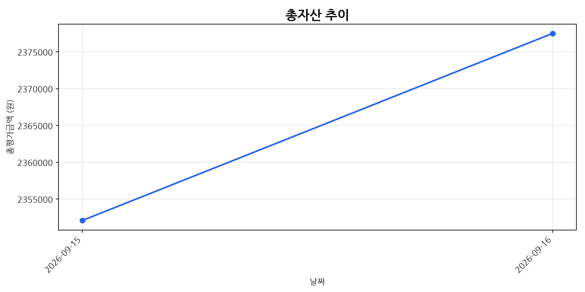
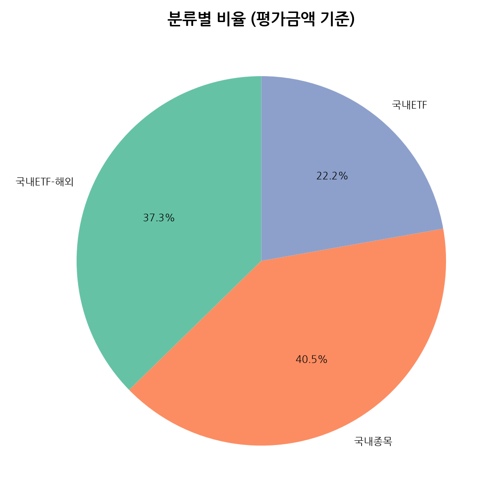

# swing-chart (public)

[swing-trade](../swing-trade) 레포의 GitHub Actions 워크플로우가 평일
09~20시(KST) 매시 정각마다 자동으로 갱신하는 차트 이미지 저장소입니다.

- `charts/asset_trend.png` — 총자산 추이 (꺾은선)
- `charts/category_pie.png` — 분류별 비율 (평가금액 기준, 파이차트)

이 레포는 **공개(public)** 여야 Notion 페이지에서
`raw.githubusercontent.com` URL로 이미지를 바로 불러올 수 있습니다. 이
레포에는 이미지 외의 민감한 정보가 들어가지 않습니다.

이미지는 사람이 직접 커밋하지 않고 Actions 봇(`swing-trade-bot`)이
매번 갱신합니다.

## 최근 차트

(첫 실행 전에는 이미지가 없어 깨져 보일 수 있습니다. swing-trade의
워크플로우를 한 번 실행하면 채워집니다.)
